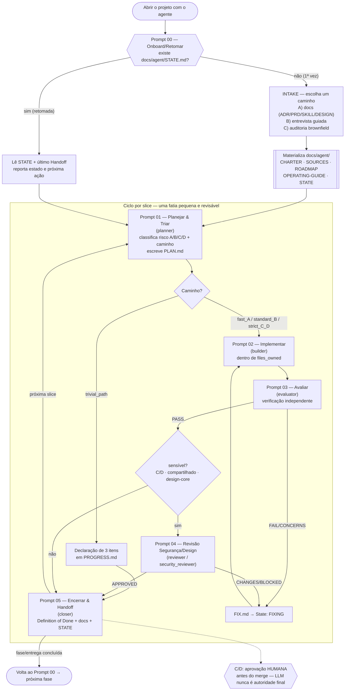

# Suíte de Prompts Agenticos — guia do time

Uma sequência de prompts que estrutura o desenvolvimento de software com um
agente, dando **qualidade consistente, rastreável e segura** — sem depender de
nenhuma ferramenta específica. Cada prompt é um bloco de texto autocontido que
você cola no seu agente (Claude Code, Codex, Cursor, etc.). Eles compartilham um
**workspace de contexto** (`docs/agent/`) que serve de memória entre turnos e
entre pessoas.

A ideia central: trabalho agentico bom não é "um prompt mágico". É um **ciclo
pequeno e auditável** — entender o contexto, planejar uma fatia, implementar,
avaliar de forma independente, revisar o que é sensível, documentar e passar o
bastão. Estes prompts encadeiam exatamente esse ciclo.

## Os prompts

| # | Arquivo | Papel | Para quê |
|---|---|---|---|
| 00 | [`00-onboard.md`](00-onboard.md) | onboarding / retomada | **Ponto de entrada.** Na 1ª vez, constrói o contexto (por docs que você indica ou entrevista guiada, ou auditoria brownfield). Depois, **retoma**: diz o estado e a próxima ação. |
| 01 | [`01-plan.md`](01-plan.md) | planner | Classifica o **risco** (A/B/C/D) e o **caminho** (trivial/fast/standard/strict), e escreve o **plano** com critérios de aceite, gates e perfil de modelo. |
| 02 | [`02-implement.md`](02-implement.md) | builder | Implementa **dentro do escopo**, sem fabricar, registrando progresso e evidência. |
| 03 | [`03-evaluate.md`](03-evaluate.md) | evaluator | **Verifica de forma independente** contra critérios e gates. Aprova ou abre pedido de correção. |
| 04 | [`04-review-security.md`](04-review-security.md) | reviewer / security_reviewer | **Condicional** (C/D, módulo compartilhado, design-core): revisão adversarial de segurança/qualidade/design. |
| 05 | [`05-closeout.md`](05-closeout.md) | closer | Checa **Definition of Done**, fecha deriva de docs, atualiza contexto e estado, prepara o próximo. |

## Como usar (fluxo típico)

1. **Primeira vez no projeto:** cole o **Prompt 00**. Ele detecta que é a
   primeira ativação (porque `docs/agent/STATE.md` ainda não existe) e te
   oferece três caminhos de intake — **A)** indicar a pasta de docs
   (ADRs, PRDs, SKILLs, DESIGN, roadmap…), **B)** responder a entrevista guiada,
   ou **C)** auditar um código já existente. Ao final, ele cria o workspace
   `docs/agent/` e propõe a primeira fase.
2. **Para cada fatia de trabalho (slice):**
   - **01 — Planejar:** descreva a intenção; o agente classifica risco/caminho e
     escreve o `PLAN.md` (você confirma a proposta).
   - **02 — Implementar:** o agente coda dentro do escopo e registra evidência.
   - **03 — Avaliar:** verificação independente; PASS ou pedido de correção.
   - **04 — Revisar:** **só** se a slice for sensível (C/D), compartilhada ou de
     design-core.
   - **05 — Encerrar:** Definition of Done, docs, estado, handoff.
3. **Voltar depois:** cole o **Prompt 00** de novo — agora ele **retoma** e
   aponta a próxima ação.

> O caminho operacional **encurta o ciclo** conforme o risco: uma correção de
> typo (`trivial_path`) faz só uma declaração de 3 itens e segue; uma mudança de
> auth (`strict_path_C_D`) passa por todos os prompts, com revisão de segurança e
> aprovação humana. **Burocracia segue o risco — nunca o contrário.**

## O workspace `docs/agent/` (criado pelo Prompt 00)

```
docs/agent/
  STATE.md                 # ponteiro de retomada — a AUSÊNCIA dele = primeira ativação
  OPERATING-GUIDE.md       # o contrato de trabalho que todos os prompts leem
  context/
    CHARTER.md             # identidade, personas, objetivo, escopo, riscos, stack, DoD
    SOURCES.md             # PRD/ADR/SKILL/DESIGN/roadmap registrados (autoridade + status)
    ROADMAP.md             # fases: objetivo, escopo, critérios de aceite, sequência
  work/<slug>/             # uma unidade de trabalho (slice)
    PLAN.md                # objetivo, escopo, risco, gates, model profile, condições de parada
    PROGRESS.md            # timeline, decisões, arquivos, comandos/resultados, blocos de Handoff
    REVIEW.md              # veredito do evaluator + revisão de segurança/design
    FIX.md                 # (quando reprova) motivo, escopo permitido, correções, evidência
  completed/<slug>/        # slices concluídas (movidas no encerramento)
```

**Detecção de primeira vez:** todo prompt checa `docs/agent/STATE.md`. Se não
existir, o Prompt 00 sabe que é a estreia e roda o intake; os demais pedem para
rodar o 00 antes. É um mecanismo determinístico e independente de ferramenta.

**Indicar docs (ADR/PRD/SKILL/DESIGN):** no intake (Prompt 00, Caminho A) você
passa as pastas/arquivos. O agente classifica cada um por **tipo** e
**autoridade** e registra em `SOURCES.md`. ADRs e DESIGN entram como
`authoritative` (não podem ser contrariados). SKILLs têm um `description` que
vira a **chave de seleção**: o planner (Prompt 01) casa esse texto com a
intenção da slice e vincula o playbook em `context_sources`.

## Os caminhos operacionais (risco → governança)

| Caminho | Quando | Artefatos | Revisão humana |
|---|---|---|---|
| `trivial_path` | docs/typo/formatação, sem código executável | 3 itens em `PROGRESS.md` | não |
| `fast_path_A` | Categoria A, mudança pequena | `PLAN.md` mínimo + `PROGRESS.md` | não |
| `standard_path_B` | Categoria B, muda estado/comportamento | Pre-Flight completo + `PLAN.md` + `PROGRESS.md` + `REVIEW.md` | condicional |
| `strict_path_C_D` | Categoria C/D (auth, secrets, cripto, dados regulados…) | tudo do B + `security_reviewer` + ≥4 gates + `human_review` + ADR | **obrigatória** |

Categorias de risco (fronteira de confiança, classifique de **D→A**):
**A** baixo · **B** estado/comportamento · **C** auth/secrets/superfície externa
· **D** cripto/dados regulados. *Risco se mede pelo que cruza a fronteira de um
atacante, não por número de linhas.*

## Diagrama — como os prompts se encaixam por fase



### Fallback em texto (se o Mermaid não renderizar)

```
            ┌─────────────────────────────────────────────┐
ABRIR  ───▶ │ PROMPT 00  (onboard / retomar)               │
PROJETO     │  existe docs/agent/STATE.md?                 │
            └───────────────┬───────────────┬─────────────┘
              não (1ª vez)  │               │  sim (retomada)
                            ▼               ▼
             INTAKE: A) docs   Lê STATE + último Handoff
                     B) entrevista   reporta estado + próxima ação
                     C) brownfield        │
                            │             │
                materializa docs/agent/   │
                            └──────┬──────┘
                                   ▼
   ╔═══════════════ CICLO POR SLICE ═══════════════╗
   ║  PROMPT 01 planner → classifica risco/caminho ║
   ║         │                                     ║
   ║   trivial_path ──▶ 3 itens ──────────────┐    ║
   ║         │ (fast/standard/strict)         │    ║
   ║         ▼                                 │    ║
   ║  PROMPT 02 builder (implementa no escopo) │    ║
   ║         ▼                                 │    ║
   ║  PROMPT 03 evaluator ──FAIL──▶ FIX ──▶ 02 │    ║
   ║         │ PASS                            │    ║
   ║         ▼                                 │    ║
   ║  sensível? (C/D / shared / design-core)   │    ║
   ║    sim ▶ PROMPT 04 reviewer/security ─────┤    ║
   ║    não ─────────────────────────────┐     │    ║
   ║                                     ▼     ▼    ║
   ║  PROMPT 05 closer (DoD + docs + STATE + handoff)║
   ╚════════════════┬═══════════════════┬══════════╝
       próxima slice │                   │ fase concluída
                     ▼                   ▼
                 PROMPT 01          PROMPT 00 (próxima fase)

   [C/D] aprovação HUMANA antes do merge — LLM nunca é autoridade final.
```

## Princípios que dão a qualidade (resumo)

- **Não inventar contexto.** Sem docs ou entrevista, não há stack nem fases.
- **Knowledge Verification Chain.** Codebase → docs/context → resolvedor de lib →
  web → sinalizar incerteza. Nunca fabricar APIs.
- **Pequeno, auditável, reversível.** Slices pequenas; tudo registrado em
  `PROGRESS.md`; handoff ao fim de cada turno.
- **Governança proporcional ao risco.** Quatro caminhos; C/D exige gates
  determinísticos, revisão de segurança e aprovação humana.
- **Verificação independente.** Quem avalia não é quem implementa; para fatos
  sensíveis, modelo de família diferente.
- **Definition of Done explícita.** Critérios + evidência + docs + riscos
  residuais antes de "pronto".

## Dicas de adoção

- **Renomeie à vontade.** A pasta `docs/agent/` e os nomes dos prompts são
  neutros de propósito; adapte ao seu time.
- **Slash-commands (opcional).** No Claude Code, você pode salvar cada prompt em
  `.claude/commands/` (ex.: `onboard.md`, `plan.md`) e chamá-los por `/onboard`,
  `/plan`, etc.
- **Mapeie os tiers aos seus modelos.** `light` = modelo rápido/barato;
  `standard` = equilibrado; `deep` = raciocínio de fronteira. Use o
  `suggested_model` do handoff para trocar de modelo no momento certo — costuma
  reduzir bastante o custo de uma fase.
- **Comece pequeno.** Em um projeto existente, rode o Prompt 00 no Caminho C
  (auditoria) para o agente entender o que já existe antes de planejar.
